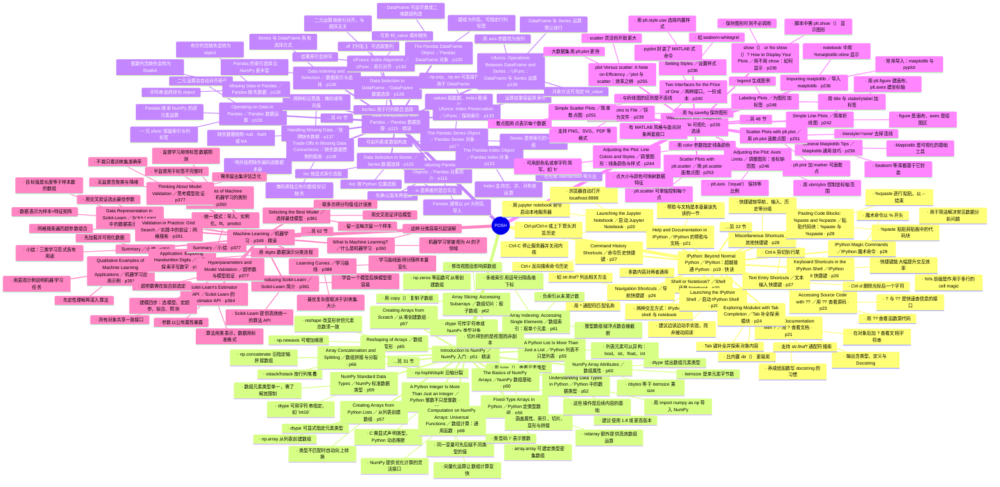

# 01 Python Data Science Handbook

`VanderPlas · Python 数据科学手册 · 548 页 · 5 章`

路径：数据与 ML 底座 → PDSH

```mermaid
mindmap
  root((PDSH))
    IPython: Beyond Normal Python ／IPython：超越普通 Python · p19 · 快读
      Shell or Notebook? ／Shell 还是 Notebook · p20
        · 两种交互方式：IPython shell 与 notebook
        · 多数内容对两者通用
      Launching the IPython Shell ／启动 IPython Shell · p20
        · 建议边读边动手实验，而非被动阅读
      Launching the Jupyter Notebook ／启动 Jupyter Notebook · p20
        · 用 jupyter notebook 命令启动本地服务器
        · 浏览器自动打开 localhost:8888
        · Ctrl-C 停止服务器并关闭内核
      Help and Documentation in IPython ／IPython 的帮助与文档 · p21
        · 帮助与文档是本章最该先读的一节
      Accessing Documentation with ? ／用 ? 查看文档 · p21
        · 在对象后加 ? 查看文档字符串
        · 输出含类型、定义与 Docstring
        · 养成给函数写 docstring 的习惯
      Accessing Source Code with ?? ／用 ?? 查看源码 · p23
        · 用 ?? 查看函数源代码
        · ? 与 ?? 是快速查信息的接口
      Exploring Modules with Tab Completion ／Tab 补全探索模块 · p24
        · Tab 键补全并探索对象内容
        · 比内置 dir（） 更易用
        · 支持 str.*find*? 通配符搜索
      Keyboard Shortcuts in the IPython Shell ／IPython Shell 快捷键 · p26
        · 快捷键能大幅提升交互效率
      Navigation Shortcuts ／导航快捷键 · p26
        · 用 * 通配符匹配名称
        · 如 str.*find*? 列出相关方法
      Text Entry Shortcuts ／文本输入快捷键 · p27
        · Ctrl-d 删除光标后一个字符
        · Ctrl-k 剪切到行尾
      Command History Shortcuts ／命令历史快捷键 · p27
        · Ctrl-r 反向搜索命令历史
        · Ctrl-p/Ctrl-n 或上下箭头浏览历史
      Miscellaneous Shortcuts ／其他快捷键 · p28
        · 快捷键按导航、输入、历史等分组
      IPython Magic Commands ／IPython 魔术命令 · p28
        · 魔术命令以 % 开头
        · %% 前缀是作用于多行的 cell magic
        · 用于简洁解决常见数据分析问题
      Pasting Code Blocks: %paste and %cpaste ／粘贴代码块：%paste 与 %cpaste · p29
        · %paste 粘贴剪贴板中的代码块
        · %cpaste 逐行粘贴，以 -- 结束
      …另 22 节
    Introduction to NumPy ／NumPy 入门 · p51 · 精读
      Understanding Data Types in Python ／Python 中的数据类型 · p52
        · 用 import numpy as np 导入 NumPy
        · 建议使用 1.8 或更高版本
      A Python Integer Is More Than Just an Integer ／Python 整数不只是整数 · p53
        · C 需显式声明类型，Python 动态推断
        · 同一变量可先后赋不同类型的值
      A Python List Is More Than Just a List ／Python 列表不只是列表 · p55
        · 列表元素可以异构：bool、str、float、int
        · 用 type（） 查看元素类型
      Fixed-Type Arrays in Python ／Python 定类型数组 · p56
        · array.array 可建定类型密集数组
        · ndarray 额外提供高效数组运算
        · 类型码 'i' 表示整数
      Creating Arrays from Python Lists ／从列表创建数组 · p57
        · np.array 从列表创建数组
        · 类型不匹配时自动向上转换
        · dtype 可显式指定元素类型
      Creating Arrays from Scratch ／从零创建数组 · p57
        · np.zeros 等函数可从零创建数组
        · dtype 可传字符串或 NumPy 类型对象
      NumPy Standard Data Types ／NumPy 标准数据类型 · p59
        · 数组元素类型单一，需了解其限制
        · dtype 可用字符串指定，如 'int16'
      The Basics of NumPy Arrays ／NumPy 数组基础 · p60
        · 涵盖属性、索引、切片、变形与拼接
        · 这些操作是后续内容的基础
      NumPy Array Attributes ／数组属性 · p60
        · dtype 给出数组元素类型
        · itemsize 是单元素字节数
        · nbytes 等于 itemsize 乘 size
      Array Indexing: Accessing Single Elements ／数组索引：取单个元素 · p61
        · 多维索引用逗号分隔各维下标
        · 负索引从末尾计数
        · 整型数组赋浮点数会被截断
      Array Slicing: Accessing Subarrays ／数组切片：取子数组 · p62
        · 切片得到的是视图而非副本
        · 用 copy（） 复制子数组
        · 修改视图会影响原数组
      Reshaping of Arrays ／数组变形 · p65
        · reshape 改变形状但元素总数须一致
        · np.newaxis 可增加维度
      Array Concatenation and Splitting ／数组拼接与分裂 · p66
        · np.concatenate 沿指定轴拼接数组
        · vstack/hstack 按行列堆叠
        · np.hsplit/dsplit 沿轴分裂
      Computation on NumPy Arrays: Universal Functions ／数组计算：通用函数 · p68
        · 向量化运算让数组计算变快
        · NumPy 提供优化计算的灵活接口
      …另 31 节
    Data Manipulation with Pandas ／Pandas 数据处理 · p115 · 精读
      Introducing Pandas Objects ／Pandas 对象简介 · p116
        · Pandas 通常以 pd 为别名导入
        · 先确认版本再使用
      The Pandas Series Object ／Pandas Series 对象 · p117
        · Series 是带索引的一维数组
        · values 取数据，index 取索引
        · 可由列表或数组构造
      The Pandas DataFrame Object ／Pandas DataFrame 对象 · p120
        · DataFrame 可由字典或二维数组构造
        · 键成为列名，可指定行列标签
      The Pandas Index Object ／Pandas Index 对象 · p123
        · Index 支持交、并、对称差运算
        · 也可用 intersection 等方法
      Data Indexing and Selection ／数据索引与选择 · p125
        · Pandas 的索引选择比 NumPy 更丰富
        · Series 与 DataFrame 各有选择方式
      Data Selection in Series ／Series 数据选择 · p125
        · loc 按显式索引选取
        · iloc 按 Python 位置选取
        · ix 是两者的混合写法
      Data Selection in DataFrame ／DataFrame 数据选择 · p128
        · df【'列名'】 可选取整列
        · loc/iloc 用于行列联合选择
      Operating on Data in Pandas ／Pandas 数据运算 · p133
        · Pandas 继承 NumPy 的逐元素运算
        · 一元 ufunc 保留索引与列标签
        · 二元运算会自动对齐索引
      Ufuncs: Index Preservation ／UFunc：保持索引 · p133
        · np.exp、np.sin 可直接作用于 DataFrame
        · 运算结果保留原索引
      UFuncs: Index Alignment ／UFunc：索引对齐 · p134
        · 二元运算按索引对齐，与顺序无关
        · 结果索引会排序
        · 可用 fill_value 填补缺失
      Ufuncs: Operations Between DataFrame and Series ／UFunc：DataFrame 与 Series 运算 · p136
        · DataFrame 与 Series 运算默认按行
        · 用 axis 参数改为按列
        · 对象方法可指定 fill_value
      Handling Missing Data ／处理缺失数据 · p137
        · 缺失数据统称 null、NaN 或 NA
        · 两种标记思路：掩码或哨兵值
      Trade-Offs in Missing Data Conventions ／缺失数据惯例的取舍 · p138
        · 掩码用独立布尔数组标记缺失
        · 哨兵值把缺失编码进数据本身
      Missing Data in Pandas ／Pandas 缺失数据 · p138
        · 整数列含缺失会转为 float64
        · 布尔列含缺失会转为 object
        · 字符串始终存为 object
      …另 43 节
    Visualization with Matplotlib ／Matplotlib 可视化 · p235 · 选读
      General Matplotlib Tips ／Matplotlib 通用技巧 · p236
        · Matplotlib 是可视化的基础工具
        · Seaborn 等库都基于它封装
      Importing matplotlib ／导入 matplotlib · p236
        · 常用导入：matplotlib 与 pyplot
        · notebook 中用 %matplotlib inline 显示
      Setting Styles ／设置样式 · p236
        · 用 plt.style.use 选择内置样式
        · 如 seaborn-whitegrid
      show（） or No show（）? How to Display Your Plots ／用不用 show：如何显示 · p236
        · 脚本中需 plt.show（） 显示图形
        · 保存图形时则不必调用
      Saving Figures to File ／将图形保存为文件 · p239
        · 用 fig.savefig 保存图形
        · 支持 PNG、SVG、PDF 等格式
      Two Interfaces for the Price of One ／两种接口，一份成本 · p240
        · 有 MATLAB 风格与面向对象两套接口
        · pyplot 封装了 MATLAB 式命令
      Simple Line Plots ／简单折线图 · p242
        · 用 plt.figure 建画布、plt.axes 建坐标轴
        · figure 是画布，axes 是绘图区
      Adjusting the Plot: Line Colors and Styles ／调整图形：线条颜色与样式 · p244
        · 用 color 参数指定线条颜色
        · 可用颜色名或单字符简写，如 'b'
      Adjusting the Plot: Axes Limits ／调整图形：坐标轴范围 · p246
        · 用 xlim/ylim 控制坐标轴范围
        · plt.axis（'equal'） 保持等比例
      Labeling Plots ／为图形加标签 · p248
        · 用 title 与 xlabel/ylabel 加标签
        · legend 生成图例
      Simple Scatter Plots ／简单散点图 · p251
        · 散点图用点表示每个数据
        · 与折线图的区别是不连线
      Scatter Plots with plt.plot ／用 plt.plot 画散点图 · p251
        · plt.plot 加 marker 可画散点
        · linestyle='none' 去掉连线
      Scatter Plots with plt.scatter ／用 plt.scatter 画散点图 · p253
        · plt.scatter 可单独控制每个点
        · 点大小与颜色可映射数据特征
      plot Versus scatter: A Note on Efficiency ／plot 与 scatter：效率之辨 · p255
        · 大数据集用 plt.plot 更快
        · scatter 灵活但开销更大
      …另 48 节
    Machine Learning ／机器学习 · p349 · 精读
      What Is Machine Learning? ／什么是机器学习 · p350
        · 机器学习常被视为 AI 的子领域
        · 这种分类容易引起误解
      Categories of Machine Learning ／机器学习的类别 · p350
        · 监督学习用带标签数据预测
        · 无监督含聚类与降维
        · 半监督用于标签不完整时
      Qualitative Examples of Machine Learning Applications ／机器学习应用示例 · p351
        · 用直观示例说明机器学习任务
        · 先定性理解再深入算法
      Summary ／小结 · p360
        · 小结：三类学习范式各有用途
      Introducing Scikit-Learn ／Scikit-Learn 简介 · p361
        · Scikit-Learn 提供高效统一的算法 API
        · 学会一个模型后换模型很容易
      Data Representation in Scikit-Learn ／Scikit-Learn 中的数据表示 · p361
        · 数据表示为样本×特征矩阵
        · 目标值是长度等于样本数的数组
      Scikit-Learn’s Estimator API ／Scikit-Learn 的 Estimator API · p364
        · 所有对象共享一致接口
        · 参数以公有属性暴露
        · 算法用类表示，数据用标准格式
      Application: Exploring Handwritten Digits ／应用：探索手写数字 · p372
        · 用 digits 数据演示分类流程
        · 先加载并可视化数据
      Summary ／小结 · p377
        · 统一模式：导入、实例化、fit、predict
      Hyperparameters and Model Validation ／超参数与模型验证 · p377
        · 建模四步：选模型、定超参、拟合、预测
        · 超参数需在拟合前选定
      Thinking About Model Validation ／思考模型验证 · p377
        · 不能只看训练集准确率
        · 需用留出集评估泛化
      Selecting the Best Model ／选择最佳模型 · p381
        · 用交叉验证评估模型
        · 留一法每次留一个样本
        · 取多次得分均值估计误差
      Learning Curves ／学习曲线 · p388
        · 最优复杂度取决于训练集大小
        · 学习曲线画得分随样本量变化
      Validation in Practice: Grid Search ／实践中的验证：网格搜索 · p391
        · 网格搜索遍历超参数组合
        · 用交叉验证选出最佳参数
      …另 62 节
```