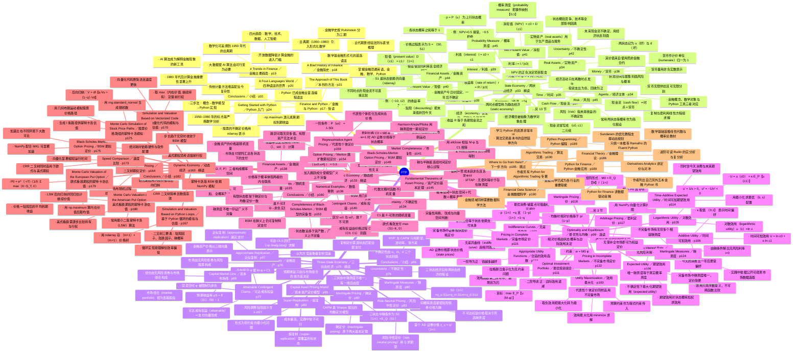

# 05 Financial Theory with Python

`Hilpisch · Python 金融理论 · 204 页 · 7 章`

路径：金融理论 → FTP

```mermaid
mindmap
  root((FTP))
    Finance and Python ／金融与 Python · p17 · 快读
      A Brief History of Finance ／金融简史 · p18
        · 金融学史按 Rubinstein 分为三期
        · 古代期靠经验法则与直觉推理
        · 古典期（1950–1980）引入形式化数学
      Major Trends in Finance ／金融主要趋势 · p19
        · 四大趋势：数学、技术、数据、人工智能
        · 数学化可追溯到 1950 年代的古典期
        · AI 算法成为解释金融现象的新工具
      A Four-Languages World ／四种语言的世界 · p20
        · 开放数据降低计算金融的进入门槛
        · 大数据使 AI 算法由可行变为必要
        · 传统计量方法难适配当今复杂性
      The Approach of This Book ／本书的方法 · p21
        · 掌握金融须通英语、金融、数学、Python
        · 数学是金融形式化的首选语言
        · Python 已成金融业首选编程语言
      Getting Started with Python ／Python 入门 · p24
        · 三步法：概念→数学模型→Python 实现
        · 股票的不确定价格用 ndarray 表示
        · np.maximum 逐元素算期权到期收益
      Conclusions ／小结 · p31
        · 1950–1980 年的标志是严格数学分析
        · 1980 年代后计算金融重要性显著上升
    Two-State Economy ／两状态经济 · p33 · 精读
      Economy ／经济 · p34
        · 经济（economy）含主体、实物与金融资产
        · 经济概念被抽象为数学对象处理
      Real Assets ／实物资产 · p34
        · 实物资产（real assets）用于生产商品与服务
        · 其价值来自使用而非金融合约
      Agents ／经济主体 · p34
        · 金融概念、数学对象与 Python 工具三者对应
        · 状态空间与幂集刻画风险与概率
        · 复制与套利用线性方程组求解
      Time ／时间 · p35
        · 经济活动只在离散时点发生
        · 只取 t=0 与 t=1 两个时点
        · 两时点模型称为静态经济（static economy）
      Money ／货币 · p36
        · 货币无限供给且可无限分割
        · 货币作计价单位（numeraire）归一为 1
        · 货币量用非负实数表示
      Cash Flow ／现金流 · p37
        · 现金流（cash flow）＝时点＋货币
        · 投资支出为负、回收为正
        · 现金流常写成 （c0, c1） 二元组
      Return ／收益率 · p39
        · 收益 R 等于各期现金流之和
        · 收益率（rate of return）r = R / |c0|
        · 例：（−10, 12） 的收益率为 0.2
      Interest ／利息 · p39
        · 利息（interest）I = c0 + c1
        · 利率 i = I / |c0|
        · 假设借贷同利率且全经济固定
      Present Value ／现值 · p40
        · 不同时点的现金流不可直接比较
        · 贴现（discounting）把未来值折回今天
        · 现值（present value）D（c1） = c1 / （1+i）
      Net Present Value ／净现值 · p41
        · 净现值（NPV）= c0 + D（c1）
        · NPV 的正负决定项目取舍
        · 例：NPV=0.5 接受，−0.5 拒绝
      Uncertainty ／不确定性 · p42
        · 未来现金流不确定，用经济状态刻画
        · 两状态记为 u（好）与 d（坏）
        · 状态概括竞争、技术等全部影响因素
      Financial Assets ／金融资产 · p44
        · 金融资产今日价固定、一年后不确定
        · 价格过程表示为 S = （S0, S1）
        · S1 是状态依赖的向量（ndarray）
      Risk ／风险 · p45
        · 风险（risk）指未来收益的不确定性
        · 常用两状态等概率作为简化假设
      Probability Measure ／概率测度 · p45
        · 概率测度（probability measure）把事件映到 【0,1】
        · 各状态概率之和等于 1
        · p = P（u） 为上行状态概率
      …另 13 节
    Three-State Economy ／三状态经济 · p75 · 精读
      Uncertainty ／不确定性 · p76
        · 三状态经济沿用两状态经济的假设
        · 不确定性由 u、m、d 三个状态刻画
      Financial Assets ／金融资产 · p76
        · 金融资产价格以三维向量表示
        · 市场由无风险债券与风险股票构成
      Attainable Contingent Claims ／可达或有权益 · p77
        · 可达或有权益（attainable）＝支付向量张成
        · 存在组合 φ 使 M·φ = C1
        · 禁卖空时 φ 被限制为非负
      Martingale Pricing ／鞅定价 · p80
        · 鞅定价（martingale pricing）源于两大基本定理
        · 三状态中鞅条件为 S0（1+i）=E_Q（S1）
      Martingale Measures ／鞅测度 · p80
        · 任何概率测度都使贴现债券价格为鞅
        · S0（1+i）=q_u·S1u+q_m·S1m+q_d·S1d
        · 三状态中鞅测度不唯一，有一维自由度
      Risk-Neutral Pricing ／风险中性定价 · p83
        · 风险中性定价（risk-neutral pricing）用 Q 求期望
        · 不可达权益价格取决于所选鞅测度
        · 首个 AD 证券价格 γ_u = q/（1+i）
      Super-Replication ／超复制 · p83
        · 超复制（super-replication）需覆盖所有状态
        · 形式为带约束的最小化问题
        · 成本偏高，实践中常不可行
      Approximate Replication ／近似复制 · p87
        · 近似复制（approximate replication）逼近支付
        · 以均方误差衡量复制误差
        · 可由 OLS 回归（np.linalg.lstsq）求解
      Capital Market Line ／资本市场线 · p89
        · 市场组合（market portfolio）视为宽基股指
        · 组合由无风险债券与市场组合构成
        · 预期收益率 μS = E（S1）/S0 − 1
      Capital Asset Pricing Model ／资本资产定价模型 · p91
        · CAPM 是 Sharpe 提出的均衡定价模型
        · 预期收益只由与市场组合的协方差决定
        · 风险调整贴现因子含 λ·σST
      Conclusions ／小结 · p96
        · MVP 与 CAPM 只用期望、波动率、协方差
        · 复制定价需逐状态匹配全部支付
    Optimality and Equilibrium ／最优性与均衡 · p99 · 选读
      Utility Maximization ／效用最大化 · p100
        · 效用最大化用 minimize 求解
        · 取负效用把最大化转为最小化
        · 预算约束作为等式约束传入
      Indifference Curves ／无差异曲线 · p102
        · 无差异曲线（indifference curve）连相同效用
        · 最优消费-储蓄点可借曲线可视化
      Appropriate Utility Functions ／合适的效用函数 · p104
        · 效用函数需二阶可导、递增且为凹
        · 一阶导为正：钱越多越好
        · 二阶导非正：边际效用递减
      Logarithmic Utility ／对数效用 · p105
        · 对数效用（logarithmic utility）u（x）=ln x
        · u′ = 1/x > 0，u″ = −1/x² < 0
        · 用 NumPy 向量化计算并绘图
      Time-Additive Utility ／时间可加效用 · p106
        · 时间可加效用 U = ln c0 + κ·ln c1
        · κ 取值 （0,1】 表示时间偏好
        · 今天的消费比一年后更受偏好
      Expected Utility ／期望效用 · p109
        · 不确定性下最大化期望效用（expected utility）
        · 期望效用对状态概率加权求效用
        · 效用只具序数意义，不可跨函数比较
      Optimal Investment Portfolio ／最优投资组合 · p111
        · 目标：max E_P【u（M·φ）】
        · 约束：w = M0·φ
        · 拉格朗日乘子化为无约束问题
      Time-Additive Expected Utility ／时间可加期望效用 · p114
        · U = u（c0） + κ·E_P【u（c1）】
        · 同时含今天消费与未来期望效用
        · 用最小化求最优 （b, s） 配置
      Pricing in Complete Markets ／完备市场定价 · p115
        · 完备市场中证券按状态价格定价
        · AD 证券价格即状态价格（state prices）
        · 复制组合等于状态依赖支付本身
      Arbitrage Pricing ／套利定价 · p117
        · 相对价格由状态概率与边际效用决定
        · 均衡时相对价格等于 p/（1−p）
        · 绝对价格由初始财富决定
      Martingale Pricing ／鞅定价 · p118
        · 矩阵形式：M0 = E_Q【M】/（1+i）
        · p（1+i）=q 且 （1−p）（1+i）=1−q
        · 解得 i=0 且 q=p
      Risk-Less Interest Rate ／无风险利率 · p118
        · 由鞅条件解出无风险利率 i=0
        · 唯一鞅测度等于真实概率测度
      Pricing in Incomplete Markets ／不完备市场定价 · p122
        · 代表性个体定价同样适用不完备市场
        · 无需补全市场即可为权益定价
      Martingale Measures ／鞅测度 · p124
        · 不完备市场有无穷多个相容鞅测度
        · 实践中依据公开可观测市场数据选取
        · 完备市场中鞅测度唯一，定价简便
      …另 3 节
    Static Economy ／静态经济 · p133 · 精读
      Uncertainty ／不确定性 · p134
        · 概率空间＝状态空间＋代数＋概率测度
        · 完备性用秩、张成与向量空间判断
        · BSM 用几何布朗运动刻画价格
      Random Variables ／随机变量 · p135
        · 概率测度满足非负、可加、全概率为 1
        · （Ω, F, P） 三者构成概率空间
        · 随机变量是 F-可测函数 S: Ω→非负实数
      Numerical Examples ／数值算例 · p136
        · 代数太粗时函数不再是随机变量
        · F 不区分 ω1 与 ω2，故 T 不可测
        · P（｛ω1,ω2｝） = P（｛ω3,ω4｝） = 0.5
      Financial Assets ／金融资产 · p138
        · 金融资产的价格是随机变量
        · 市场支付矩阵汇总各状态下的支付
        · 收益率与波动率用 mean（）、std（） 计算
      Contingent Claims ／或有权益 · p140
        · 或有权益由价格过程 C=（C0, C1） 刻画
        · 欧式看涨支付 max（S1−K, 0）
        · C1 是 F-可测的随机变量
      Market Completeness ／市场完备性 · p141
        · 复制组合由解线性方程组得到
        · 套利价格 C0 = M0·φ
        · 用 allclose 检验 M·φ 与 C1 相等
      Fundamental Theorems of Asset Pricing ／资产定价基本定理 · p145
        · 套利＝零成本获非负且非零支付
        · 1FTAP：无套利等价于存在鞅测度
        · 支付矩阵满秩则列向量线性无关
      Black-Scholes-Merton Option Pricing ／BSM 期权定价 · p149
        · BSM 假设价格服从几何布朗运动
        · Harrison-Kreps/Pliska 用鞅测度统一期权定价
        · 鞅与半鞅是连续时间定价核心过程
      Completeness of Black-Scholes-Merton ／BSM 模型的完备性 · p153
        · 状态数远多于资产数，广义上不完备
        · 鞅测度不唯一印证广义不完备
        · BSM 在狭义上仍可复制特定支付
      Merton Jump-Diffusion Option Pricing ／Merton 跳扩散期权定价 · p154
        · 加入跳跃成分使模型广义上不完备
        · 跳跃可取无穷多值，有限资产无法补全
      Representative Agent Pricing ／代表性个体定价 · p159
        · 代表性个体优化生成状态价格
        · 一阶条件：P（ωi） = λ·S0i
        · w=1 时 AD 证券价格等于状态概率
      Conclusions ／小结 · p160
        · 有限状态框架下鞅定价与均衡定价一致
        · 价格等于概率体现两者的内在联系
    Dynamic Economy ／动态经济 · p163 · 精读
      Binomial Option Pricing ／二叉树期权定价 · p164
        · 动态完备市场用随机过程给期权定价
        · 欧式期权用内在价值与后向归纳
        · 美式期权须考虑提前行权
      Simulation and Valuation Based on Python Loops ／基于 Python 循环的模拟与估值 · p167
        · 二叉树三要素：贴现因子、涨跌因子、鞅概率
        · 循环实现易理解但效率偏低
        · 用 ndarray 存 （m+1）×（m+1） 价格树
      Simulation and Valuation Based on Vectorized Code ／基于向量化代码的模拟与估值 · p170
        · 后向归纳：V = df·【q·Vu + （1−q）·Vd】
        · 取 max（内在价值, 继续持有） 定提前行权
        · 向量化代码更简洁且速度更快
      Speed Comparison ／速度比较 · p173
        · CRR 二叉树同时适用于欧式与美式期权
        · 步长趋于无穷时收敛于 BSM 模型
        · 向量化显著缩短运行时间
      Black-Scholes-Merton Option Pricing ／BSM 期权定价 · p175
        · 绝对耗时依赖硬件与软件配置
        · NumPy 配合 MKL 可显著加速
        · 加速比在不同环境下大致可比
      Monte Carlo Simulation of Stock Price Paths ／股票价格路径的蒙特卡洛模拟 · p175
        · 用几何布朗运动模拟股票价格路径
        · 用 rng.standard_normal 生成随机数
        · 生成 I 条路径供蒙特卡洛估值
      Monte Carlo Valuation of the European Put Option ／欧式看跌期权的蒙特卡洛估值 · p179
        · 价格＝贴现后的平均到期收益
        · P0 = e^（−rT）·（1/I）·Σ max（K−S_T, 0）
        · 用 np.maximum 算内在价值后取均值
      Monte Carlo Valuation of the American Put Option ／美式看跌期权的蒙特卡洛估值 · p180
        · 美式看跌需逐步比较持有与行权
        · 常用最小二乘蒙特卡洛（LSM）算法
        · LSM 后向归纳并回归估计继续价值
      Conclusions ／小结 · p182
        · CRR 二叉树简单且数值高效
        · 蒙特卡洛版 BSM 依赖 NumPy 模拟
    Where to Go from Here? ／下一步方向 · p185 · 跳过
      Financial Theory ／金融理论 · p186
        · 数学基础首推线性代数与概率论教材
        · 进阶可读 Rudin 的实分析与复分析
        · Sundaram 的优化教程支撑动态规划
      Python Programming ／Python 编程 · p189
        · 学习 Python 的资源非常丰富
        · 只挑一本推荐 Ramalho 的 Fluent Python
      Python for Finance ／Python 金融应用 · p189
        · 作者列出自己另外五本金融 Python 书
        · Python for Finance 讲数据驱动金融
        · Derivatives Analytics 讲定价与对冲
      Financial Data Science ／金融数据科学 · p190
        · 数据科学已成为各行业的重要职能
        · 金融领域同样需要数据科学方法
      Algorithmic Trading ／算法交易 · p190
        · 算法交易是本书的自然延伸方向
        · 作者另有 Python for Algorithmic Trading 专著
```