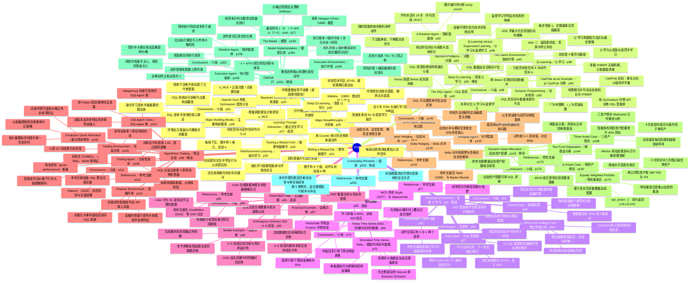

# 06 Reinforcement Learning for Finance

`Hilpisch · 面向金融的强化学习 · 215 页 · 10 章`

路径：策略与强化学习 → RLF

```mermaid
mindmap
  root((RLF))
    Learning Through Interaction ／通过交互学习 · p17 · 选读
      Tossing a Biased Coin ／抛掷有偏硬币 · p18
        · 每局下注，猜中得 1 美元，否则 0
        · 状态空间与动作空间均为 ｛1,0｝
        · 目标是最大化累计奖励
      Rolling a Biased Die ／掷有偏骰子 · p21
        · 骰子有 6 个面，动作与状态各 6 种
        · 用 Counter 统计历史频率来选动作
        · 每局后把观测结果加入动作空间
      Bayesian Updating ／贝叶斯更新 · p23
        · 贝叶斯更新：逐局更新动作频率
        · α_MLE = 正面次数 / 总抛掷次数
        · 增量更新使估计收敛到 α_MLE
      Reinforcement Learning ／强化学习 · p25
        · 强化学习依赖智能体与环境的交互
        · 目标是在交互中学会行为以实现目标
        · 交互按离散时间步序列展开
      Major Breakthroughs ／重大突破 · p26
        · 近十年 DNN 与强化学习双双崛起
        · Watkins （1989） 奠定现代 Q 学习
        · 突破多来自 RL 与深度学习结合
      Major Building Blocks ／主要构成要素 · p28
        · DQL 的成功可拆解为主要构成要素
        · OpenAI Gym 停更，Gymnasium 是其分支
        · 环境应只保留与问题相关的要素
      Deep Q-Learning ／深度 Q 学习 · p30
        · 环境建模宜简不宜繁（爱因斯坦原则）
        · 环境须包含相关因素、剔除无关因素
        · 状态空间可达 10^40，最优策略只能近似
      Conclusions ／小结 · p31
        · 强化学习是本书最重要的算法族
        · 简单下注例子即实现了贝叶斯更新
        · DQL 是本书采用的核心算法
    Deep Q-Learning ／深度 Q 学习 · p33 · 精读
      Decision Problems ／决策问题 · p34
        · 金融可视为优化技术的系统应用
        · 按动作空间分为离散与连续优化
        · 下注属静态、下棋属动态优化
      Dynamic Programming ／动态规划 · p35
        · 有限期马尔可夫动态规划记为 FHMDP
        · 元组含状态空间 S 与动作空间 A
        · T 为有限期，r_t 为奖励函数
      Q-Learning ／Q 学习 · p38
        · Q 学习用数值方法近似最优策略
        · 多数 FHMDP 无解析解，只能数值求解
        · Q 学习从奖励与惩罚中学习
      CartPole as an Example ／以 CartPole 为例 · p40
        · CartPole 目标：推车左右以保持杆平衡
        · 用 Gymnasium 环境 API 训练 DQL 智能体
      The Game Environment ／游戏环境 · p40
        · step（） 返回新状态、奖励与终止标志
        · 每步奖励 1，步数越多总奖励越高
        · 状态是 4 维浮点数组
      A Random Agent ／随机智能体 · p42
        · 随机智能体每步随机采样动作
        · 平均存活约 19 步（平均奖励 18.67）
        · 偶尔碰巧得分称 lucky punch
      The DQL Agent ／DQL 智能体 · p43
        · DQL 用深度神经网络逼近 Q 值
        · 用 deque 实现经验回放缓冲
        · Keras 搭建 Dense 全连接网络
      Q-Learning Versus Supervised Learning ／Q 学习与监督学习 · p48
        · DQL 学最大化总奖励的动作策略
        · 监督学习学特征到标签的映射
        · DQL 数据由交互顺序产生
      Conclusions ／小结 · p48
        · 本章对比 Q 学习与监督学习
        · DQL 的目标与数据来源均不同
    Financial Q-Learning ／金融 Q 学习 · p51 · 精读
      DQL Agent ／DQL 智能体 · p57
        · 让 DQL 智能体在金融环境玩预测博弈
        · 预测 EUR/USD 下一期的涨跌方向
        · 测试准确率约 52.5%，高于 50%
      Where the Analogy Fails ／类比失效之处 · p59
        · CartPole 默认提供随机初始状态
        · 静态数据初值固定，状态序列唯一
        · 状态转移本身是确定性的
      Limited Data ／数据有限 · p59
        · 静态数据集严重限制可用训练数据
        · 数据集仅有 2500 多个数据点
      No Impact ／无影响 · p60
        · 假设智能体动作不影响下一状态
        · 不论动作如何，下一状态都会揭示
        · 该假设适用于静态与模拟数据
      Conclusions ／小结 · p62
        · 用真实历史价格数据构建金融环境
        · DQL 智能体学会预测未来价格动向
      References ／参考文献 · p62
        · 参考文献涵盖强化学习与金融预测文献
    Simulated Data ／模拟数据 · p65 · 选读
      Noisy Time Series Data ／含噪时间序列数据 · p66
        · 在原始价格序列上叠加正态白噪声
        · NoisyData 环境由 Finance 环境改造
        · 动作空间只有 0 与 1 两个选择
      Simulated Time Series Data ／模拟时间序列数据 · p70
        · 用蒙特卡洛模拟生成无限条路径
        · 单条路径可与预期性质明显偏离
        · 含比例波动的 Vasicek 即 Brennan-Schwartz
      Conclusions ／小结 · p76
        · 趋势行情下预测准确率约 55%
        · 均值回复行情下预测明显更难
        · 学习率取 0.0001，训练 500 回合
      References ／参考文献 · p77
        · MCS 参考 Boyle （1977） 与 Glasserman
        · 趋势型序列典型如股价指数
    Generated Data ／生成数据 · p81 · 选读
      Simple Example ／简单示例 · p82
        · GAN 由生成器与判别器对抗训练
        · 生成器的目标是骗过判别器
        · 本节用确定性函数生成的数据训练
      Financial Example ／金融示例 · p87
        · 生成五组合成数据与真实数据比较
        · 合成数据在区间两端拟合较差
        · 用 MSE 衡量合成与真实的差距
      Kolmogorov-Smirnov Test ／K-S 检验 · p92
        · K-S 检验判断样本是否来自给定分布
        · K-S 检验比较合成与真实收益分布
      Conclusions ／小结 · p94
        · GAN 合成数据肉眼与判别器都难区分
        · 传统统计检验也难识别合成数据
        · GAN 可为 RL 提供近乎无限的数据
      References ／参考文献 · p95
        · 参考文献含 Goodfellow （2014） 等 GAN 论文
    Algorithmic Trading ／算法交易 · p99 · 精读
      Prediction Game Revisited ／重访预测博弈 · p100
        · 用大量模拟序列替代单一历史序列
        · 交易环境可选用价格之外的多项特征
        · 以金融绩效而非准确率对比策略
      Trading Environment ／交易环境 · p103
        · 状态含 SYMBOL、r、SMA、MOM 等特征
        · 多特征按多个滞后拼成状态
        · d 是 0/1 的涨跌方向标签
      Trading Agent ／交易智能体 · p108
        · 训练后平均绩效 1.65，胜过随机策略
        · 用毛绩效（gross performance）衡量
        · 训练用模拟数据，以绩效检验
      Conclusions ／小结 · p111
        · DQL 交易沿用第 3 章预测博弈思路
        · 智能体学会价格下行并大幅超越随机
        · Hilpisch （2020） 详述回测与实盘部署
      References ／参考文献 · p112
        · 参考文献涵盖 DQL 算法交易文献
      Finance Environment ／金融环境 · p112
        · 金融环境基于蒙特卡洛模拟并加多特征
        · 向量化与事件驱动回测评 DQL 绩效
        · 训练好的智能体可经 API 接入实盘
      DQLAgent Class ／DQLAgent 类 · p114
        · dqlagent.py 封装可复用的 DQLAgent 类
        · 该版本支持多特征而非单特征输入
        · 用 Flatten 层处理多特征张量
    Dynamic Hedging ／动态对冲 · p119 · 精读
      Delta Hedging ／delta 对冲 · p120
        · delta 对冲用股票与债券动态复制期权
        · 动态对冲、动态复制、期权复制常互换
        · 对冲环境用于模拟动态复制过程
      Hedging Agent ／对冲智能体 · p135
        · 动作取 0–1 连续值，对应 delta
        · 属连续动作空间的最优控制问题
        · 以复制误差为惩罚训练智能体
      Conclusions ／小结 · p140
        · 动态对冲与期权复制是定价与风控核心
        · 传统方法依赖特定金融模型与参数
        · DQL 可无模型地学会动态复制
      References ／参考文献 · p141
        · 参考文献含 Taleb （1996） 与 Baxter-Rennie
    Dynamic Asset Allocation ／动态资产配置 · p143 · 精读
      Two-Fund Separation ／两基金分离 · p144
        · Merton 用动态规划与贝尔曼原理求解
        · 两基金分离：风险与无风险两类基金
        · 智能体的风险资产配置常在 60% 附近
      Two-Asset Case ／两资产情形 · p160
        · 两只风险资产取 S&P 500 与 VIX
        · 两者水平高度负相关
        · 基于真实历史数据做动态配置
      Three-Asset Case ／三资产情形 · p168
        · 三资产情形 Markowitz 已作静态分析
        · 动态版本每回合随机抽取连续样本
        · 十次检验中组合价值均高于单资产
      Equally Weighted Portfolio ／等权重组合 · p174
        · 等权重组合是难以击败的基准
        · opt_action（） 改为返回 （1/3,1/3,1/3）
        · 十次测试中六次胜过最佳单资产
      Conclusions ／小结 · p175
        · 动态资产配置可用 DQL 求解
        · 60/40 组合是常见投资基准策略
      References ／参考文献 · p175
        · 参考文献覆盖动态资产配置相关研究
    Optimal Execution ／最优执行 · p181 · 精读
      The Model ／模型 · p182
        · 研究多日内大额清仓的最优执行
        · 采用 Almgren-Chriss（1999）模型
        · 价格过程假设无漂移（driftless）
      Model Implementation ／模型实现 · p184
        · 最优持仓 x（t） = X·sinh（κ（T−t））/sinh（κT）
        · κ = λσ²/η 综合风险厌恶与波动
        · 永久冲击 γ 由价格变动对成交量回归估计
      Execution Environment ／执行环境 · p190
        · 执行成本＝临时冲击＋永久冲击＋风险
        · 总执行成本 TEC 为三项之和
        · 风险厌恶 λ 越高越倾向提前清仓
      Random Agent ／随机智能体 · p193
        · 动作是当日清仓的比例
        · 奖励取负的执行成本
        · 随机执行的总成本高于最优
      Execution Agent ／执行智能体 · p195
        · 动作受剩余股数上界约束
        · 全期动作之和必须为 1
        · 需改造网络以处理约束型动作
      Conclusions ／小结 · p201
        · 现实中大额交易会显著影响价格
        · 拉长执行期会引入市场价格风险
        · 风险中性者不关心，风险厌恶者关心
    Concluding Remarks ／结语 · p203 · 快读
      References ／参考文献 · p205
        · 本书环境均假设完美流动性与零交易成本
        · 第 9 章例外，显式建模执行成本与冲击
        · 状态建模决定环境与智能体的交互方式
```