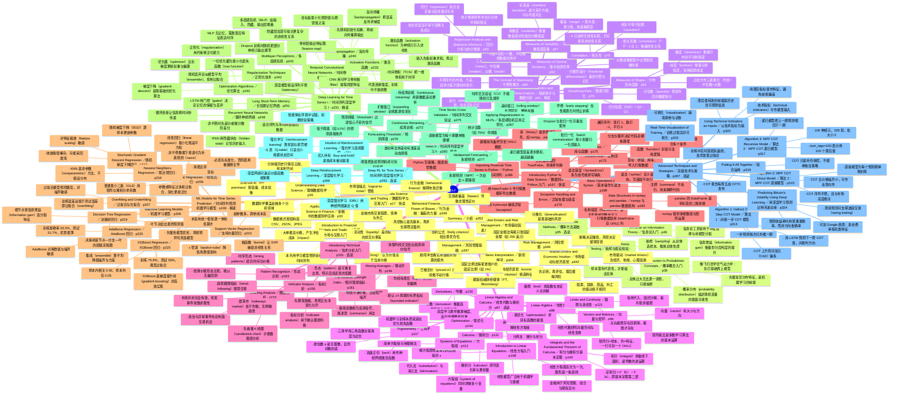

# 07 Deep Learning for Finance

`Kaabar · 面向金融的深度学习 · 362 页 · 12 章`

路径：策略与强化学习 → DLF

```mermaid
mindmap
  root((DLF))
    Introducing Data Science and Trading ／数据科学与交易入门 · p17 · 快读
      Understanding Data Science ／理解数据科学 · p26
        · 数据格式按结构选：CSV、JSON、JPEG
        · 云端与本地（on-premises）按容量、成本权衡
        · 分钟级历史行情存云端，省本地空间
      Introduction to Financial Markets and Trading ／金融市场与交易入门 · p30
        · 做多（long）：认为价值高于当前价格
        · 金融市场交易股票、债券与外汇
        · 本书用学习模型预测金融时间序列
      Applications of Data Science in Finance ／金融中的数据科学应用 · p33
        · 流动性（liquidity）差的标的成交价更差
        · 大单推高价格，产生冲击成本（impact）
        · 数据科学覆盖金融多个分析领域
    Essential Probabilistic Methods ／概率方法基础 · p35 · 选读
      Introduction to Probabilistic Concepts ／概率概念入门 · p36
        · 概率分布（probability distribution）描述随机变量的取值可能性
        · 先懂常见分布特征，是机器学习的前提
        · 像飞行员学空气动力学：先打基础再上模型
      Sampling and Hypothesis Testing ／抽样与假设检验 · p41
        · 抽样（sampling）从总体选样本、推断总体性质
        · 样本需有代表性，才能描述总体
        · 总体过大无法逐一调查，只能抽样
      A Primer on Information Theory ／信息论入门 · p46
        · 信息增益（information gain）衡量划分后纯度的提升
        · 信息论工具常用于特征选择与树模型分裂
    Descriptive Statistics and Data Analysis ／描述统计与数据分析 · p51 · 精读
      Measures of Central Tendency ／集中趋势度量 · p52
        · 三大指标：均值（mean）、中位数（median）、众数（mode）
        · 均值=总和÷个数，中位数把数据切两半
        · 众数是数据集中出现最频繁的值
      Measures of Variability ／离散程度度量 · p57
        · 离散度（variability）衡量数值相对均值的分散程度
        · 标准差（standard deviation）是方差平方根，可与均值对比
        · 极差（range）= 最大值 − 最小值，快速看跨度
      Measures of Shape ／分布形状度量 · p61
        · 偏度（skewness）衡量分布的不对称程度
        · 峰度（kurtosis）衡量尖峰程度，常用超额峰度
        · 正态分布三者重合：均值=中位数=众数
      Visualizing Data ／数据可视化 · p70
        · 分位数（quantile）把排序后的数据等分
        · 四分位距（IQR）= Q3 − Q1
      Correlation ／相关性 · p79
        · 相关系数（correlation）介于 −1 与 1，衡量线性关系
        · 相关不等于因果（causation）
        · 0 只说明无线性关联，仍可能有非线性关系
      The Concept of Stationarity ／平稳性概念 · p86
        · 平稳序列的均值、方差、自协方差不随时间变化
        · 差分（differencing）去趋势，但会丢失记忆
        · 分数阶差分（fractional differentiation）兼顾平稳与记忆
      Regression Analysis and Statistical Inference ／回归分析与统计推断 · p93
        · 回归（regression）拟合自变量与因变量的关系
        · 统计推断用样本估计总体并检验假设
        · 拟合优度高不等于因果关系成立
    Linear Algebra and Calculus ／线性代数与微积分 · p97 · 选读
      Linear Algebra ／线性代数 · p98
        · 线性代数研究向量空间与线性变换
        · 用于数据预处理、降维与解线性方程组
      Vectors and Matrices ／向量与矩阵 · p98
        · 向量（vector）有大小与方向
        · 矩阵行=样本、列=特征，一行可存一个 OHLC
        · 矩阵乘法是多数学习算法的基本运算
      Introduction to Linear Equations ／线性方程入门 · p108
        · 线性方程最高次为一次，图形是一条直线
        · 解方程即找使等式两边相等的 x
        · 线性模型广泛用于机器学习建模
      Systems of Equations ／方程组 · p112
        · 方程组（system of equations）同时求解多个变量
        · 代入法（substitution）与消元法（elimination）
        · 简单方程组可用图解法
      Trigonometry ／三角学 · p117
        · 三角学用三角函数关联角度与边长
        · 欧拉数 e 是无理数，自然对数的底
        · 双曲正切（tanh）用作神经网络激活函数
      Calculus ／微积分 · p121
        · 微积分（calculus）研究变化率与累积量
        · 分两支：微分与积分
      Limits and Continuity ／极限与连续性 · p121
        · 极限（limit）求函数在未定义点的解
        · 左右极限存在且相等，极限才存在
        · 常用代入、因式分解、乘共轭求极限
      Derivatives ／导数 · p130
        · 导数（derivative）衡量函数随输入的变化率
        · 深度学习靠导数算梯度、反向传播更新权重
      Integrals and the Fundamental Theorem of Calculus ／积分与微积分基本定理 · p140
        · 积分（integral）求曲线下面积，是导数的逆运算
        · 金融用于风险管理、组合与期权定价
        · 定积分 = F（b） − F（a），即基本定理第二部
      Optimization ／最优化 · p144
        · 最优化（optimization）求目标函数的极值
        · 机器学习训练本质就是在优化损失函数
    Introducing Technical Analysis ／技术分析入门 · p151 · 选读
      Charting Analysis ／图表分析 · p153
        · 市场并非完全有效，突发事件常致非理性
        · 先看懂 K 线图（candlestick chart）才能做图表分析
        · 政治与异常事件也会制造交易机会
      Indicator Analysis ／指标分析 · p159
        · 指标分析（indicator analysis）用于确认图表判断
        · 趋势跟随指标（trend-following）顺势交易
        · 震荡市（sideways market）处于均衡，无明确趋势
      Moving Averages ／移动平均 · p159
        · 均线平滑价格，过滤短期噪声
        · 快慢均线交叉给出趋势转向信号
        · 均线有滞后（lag），拐点识别偏晚
      The Relative Strength Index ／相对强弱指标 · p161
        · 默认 14 周期的有界指标（bounded indicator）
        · 极端读数视为反转信号，属逆势（contrarian）用法
        · 先算涨跌幅，再把正负净变化分开
      Pattern Recognition ／形态识别 · p163
        · 形态（pattern）是可重复出现、预示后续走势的配置
        · 经典价格形态主观，难以无偏回测
        · 时序形态（timing patterns）结合时间与价格
    Introductory Python for Data Science ／数据科学 Python 入门 · p167 · 快读
      Basic Operations and Syntax ／基本操作与语法 · p169
        · 语法（syntax）定义语句结构，写错就不执行
        · 注释（comment）不执行，用来解释代码
        · 本章目标：排错、用库、导入行情数据
      Control Flow ／控制流 · p173
        · 比较运算返回 True/False，供条件判断
        · 逻辑运算 and / or / not 组合多个条件
        · 分支与循环决定代码走哪条路径
      Libraries and Functions ／库与函数 · p175
        · 函数（function）封装可复用逻辑
        · 库（library）提供现成工具，如 numpy、pandas
        · 遍历序列：涨打 1、跌打 −1、平打 0
      Exception Handling and Errors ／异常处理与错误 · p179
        · 语法错误（SyntaxError）多为括号或拼写缺失
        · 名称错误（NameError）源于变量或函数未定义
        · 用 try/except 捕获异常（exception）
      Data Structures in numpy and pandas ／numpy 与 pandas 数据结构 · p182
        · numpy 提供多维数组与矩阵运算
        · pandas 的 DataFrame 是带标签的二维表格
        · 行情数据常用 DataFrame 存 OHLC 列
      Importing Financial Time Series in Python ／Python 导入金融时间序列 · p186
        · 建模前先备好历史 OHLC 数据
        · 用 MetaTrader 5 作行情数据库导出数据
        · Python 写策略，图表软件管数据
    ML Models for Time Series Prediction ／时间序列预测机器学习模型 · p193 · 精读
      Machine Learning Models ／机器学习模型 · p206
        · 先懂各模型优劣，再按预测任务选模型
        · 本章用统一框架逐一体检各算法
      Linear Regression ／线性回归 · p206
        · 线性回归（linear regression）最小化残差平方和
        · 普通最小二乘（OLS）用矩阵与微积分求系数
        · 非平稳数据下易退化为朴素预测（naive）
      Support Vector Regression ／支持向量回归 · p210
        · 核函数（kernel）让 SVR 捕捉非线性关系
        · ε 管道（epsilon-tube）降低离群值影响
        · 超参数多，调参成本高
      Stochastic Gradient Descent Regression ／随机梯度下降回归 · p213
        · 随机梯度下降（SGD）逐样本更新参数
        · 收敛路径嘈杂，可能来回震荡
        · 对特征缩放（feature scaling）敏感
      Nearest Neighbors Regression ／最近邻回归 · p216
        · KNN 是非参数（nonparametric）方法，不假设分布
        · 用最近邻样本的取值预测目标
        · 必须先标准化，否则距离被量纲主导
      Decision Tree Regression ／决策树回归 · p219
        · 决策树是节点—分支—叶的层级流程图
        · 根节点按信息增益（information gain）选分裂特征
        · 叶节点给出最终预测值
      AdaBoost Regression ／AdaBoost 回归 · p223
        · 集成（ensemble）靠平均降低噪声与方差
        · AdaBoost 对离群值与噪声敏感
        · 训练准确率 53.3%、测试 51.7%，优势很薄
      XGBoost Regression ／XGBoost 回归 · p225
        · XGBoost 是梯度提升树（gradient boosting）的高效实现
        · 训练 75.8%、测试 53%，典型过拟合
        · 样本内相关 0.92、样本外仅 0.05
      Overfitting and Underfitting ／过拟合与欠拟合 · p227
        · 训练误差远低于测试误差即过拟合（overfitting）
        · 参数或特征过多易过拟合，简化更易泛化
        · 过拟合模型预测飘忽，对噪声敏感
    Deep Learning for Time Series I ／时间序列深度学习 I · p231 · 精读
      Activation Functions ／激活函数 · p233
        · 激活函数（activation function）为神经元引入非线性
        · 输入先乘权重求和，再过激活函数
        · 权重代表连接强度，训练中不断调整
      Backpropagation ／反向传播 · p240
        · 先随机初始化权重，再前向传播算输出
        · 反向传播（backpropagation）把误差反传求梯度
        · 目标是最小化预测值与期望值之差
      Optimization Algorithms ／优化算法 · p242
        · 优化器（optimizer）沿负梯度更新权重与偏置
        · 梯度下降（gradient descent）是最基础的优化算法
        · 一切优化都为最小化损失函数（loss function）
      Regularization Techniques ／正则化技术 · p242
        · Dropout 训练时随机把部分神经元输出置零
        · 随机丢弃近似模型平均（ensemble），抑制过拟合
        · 正则化（regularization）用约束换泛化能力
      Multilayer Perceptrons ／多层感知机 · p243
        · 多层感知机（MLP）由输入、隐藏、输出层堆叠
        · 隐藏层加深可拟合更复杂的非线性关系
        · MLP 无记忆，需靠滞后特征表达时序
      Recurrent Neural Networks ／循环神经网络 · p248
        · RNN 用隐藏状态（hidden state）记住历史输入
        · 循环连接让信息跨时间步传递
        · 适合序列与带时间依赖的数据
      Long Short-Term Memory ／长短期记忆网络 · p251
        · LSTM 用门控（gates）决定记忆的保留与丢弃
        · 深度模型假设序列平稳（stationary）
        · 非平稳时先差分或做分数阶差分
      Temporal Convolutional Neural Networks ／时间卷积网络 · p259
        · CNN 用可学习卷积核（filter）提取局部特征
        · 时间卷积（TCN）把一维卷积用于时序
        · 卷积层输出特征图（feature map）
    Deep Learning for Time Series II ／时间序列深度学习 II · p265 · 精读
      Forecasting Threshold ／预测阈值 · p270
        · 预测阈值（threshold）过滤信心不足的信号
        · 低于阈值（如 ±1%）的预测直接放弃
        · 阈值把连续预测转成可执行信号
      Continuous Retraining ／持续再训练 · p272
        · 波动率法用滚动标准差设动态阈值
        · 统计法取训练集分位数（如 75%）作阈值
        · 持续再训练（continuous retraining）用新数据滚动更新
      Time Series Cross Validation ／时间序列交叉验证 · p275
        · 时序交叉验证（CV）不能随机打乱顺序
        · 滚动窗口（rolling window）长度固定、整体前移
        · 扩展窗口（expanding window）训练集逐轮变长
      Multiperiod Forecasting ／多期预测 · p277
        · 多期预测（MPF）一次给出 n 期路径
        · 递归模型误差逐步累积，越走越偏
        · 直接模型为每个期数单独建模
      Applying Regularization to MLPs ／多层感知机应用正则化 · p287
        · 批归一化（batch normalization）按小批量归一化层输入
        · 早停（early stopping）在性能恶化时终止训练
        · Dropout 与批归一化可叠加使用
    Deep RL for Time Series ／时间序列深度强化学习 · p293 · 选读
      Intuition of Reinforcement Learning ／强化学习直观理解 · p294
        · 强化学习（reinforcement learning）靠奖励与惩罚塑造行为
        · 智能体在环境中试错，积累经验策略
        · 买入持有（buy-and-hold）是低成本被动基准
      Deep Reinforcement Learning ／深度强化学习 · p300
        · 深度强化学习（DRL）用神经网络逼近 Q 值
        · Q 表（Q-table）只适合小规模状态空间
        · 深度网络可逼近价值函数或策略
    Advanced Techniques and Strategies ／高级技术与策略 · p307 · 选读
      Algorithm 1: Indirect One-Step COT Model ／算法 1：间接一步 COT 模型 · p313
        · 用 LSTM 预测下一周 COT 值，间接判方向
        · COT 上升则对加元（CAD）偏多
        · 一步预测每次只外推一期
      Algorithm 2: MPF COT Direct Model ／算法 2：MPF COT 直接模型 · p315
        · COT 比价格噪声小，可作走势向导
        · 直接模型为每个预测期单独训练
        · COT 序列平稳，且与市场高度相关
      Algorithm 3: MPF COT Recursive Model ／算法 3：MPF COT 递归模型 · p317
        · 递归模型把上一期预测喂回下一期
        · num_lags=100 表示用 100 个滞后值
        · 100 神经元、200 轮、批大小 2
      Putting It All Together ／综合运用 · p319
        · COT 报告每周五由 CFTC 发布
        · COT 只是持仓快照，不能单独当策略
      Using Technical Indicators as Inputs ／以技术指标为输入 · p320
        · 用滞后指标值作特征，避免前视偏差
        · 技术指标（technical indicators）可作模型输入
        · 滞后值有效的前提是历史含可预测信息
      Predicting Bitcoin’s Volatility Using Deep Learning ／用深度学习预测比特币波动率 · p324
        · 周频预测可支撑波段交易（swing trading）
        · 预测收益率时用普通准确率，而非方向准确率
        · 可加 Google 趋势、资金费率等另类特征
      Real-Time Visualization of Training ／训练过程实时可视化 · p333
        · 训练中实时画损失曲线，及早发现过拟合
        · 可视化（visualization）辅助调参与诊断
    Market Drivers and Risk Management ／市场驱动因素与风险管理 · p341 · 快读
      Market Drivers and Economic Intuition ／市场驱动与经济直觉 · p342
        · 市场驱动（market drivers）含经济、地缘、心理因素
        · 用经济直觉（economic intuition）挑选特征
        · 股票、固收、商品、外汇的驱动各不相同
      News Interpretation ／新闻解读 · p344
        · 新闻冲击看实际值相对预期的意外
        · 已被定价（priced in）的新闻推不动行情
        · 跟踪权威财经媒体（FT、Bloomberg）
      Risk Management ／风险管理 · p346
        · 策略决定赚钱，风控决定留得住钱
        · 分散化（diversification）是最基础的风控
        · 先识别、再评估、最后缓解风险
      Basics of Risk Management ／风险管理基础 · p347
        · 固定金额法每笔只冒固定金额（如 250 美元）
        · 固定比例法每笔冒账户的固定比例（如 1%）
        · 凯利公式（Kelly criterion）给出最优仓位
      Behavioral Finance: The Power of Biases ／行为金融：偏差的力量 · p349
        · 行为金融（behavioral finance）解释市场异象
        · 交易者偏差（biases）导致非理性定价
        · 市场信噪比（signal-to-noise）很低
      Summary ／小结 · p352
        · 风控核心是先保本，再求长期稳定盈利
```