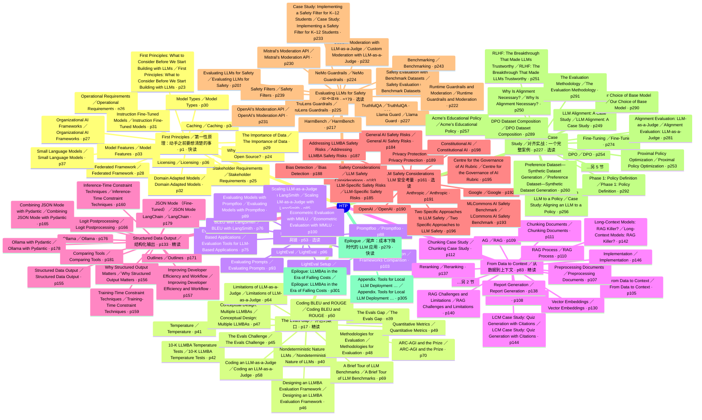

# 09 Large Language Models: The Hard Parts

`Souza & Regenstein · 大语言模型的硬骨头 · 341 页 · 9 章`

路径：文本与推理工程 → HTP

```mermaid
mindmap
  root((HTP))
    First Principles ／第一性原理：动手之前要想清楚的事 · p1 · 快读
      First Principles: What to Consider Before We Start Building with LLMs ／First Principles: What to Consider Before We Start Building with LLMs · p23
      Why Open Source? ／Why Open Source? · p24
      Stakeholder Requirements ／Stakeholder Requirements · p25
      Operational Requirements ／Operational Requirements · p26
      Organizational AI Frameworks ／Organizational AI Frameworks · p27
      Federated Framework ／Federated Framework · p28
      The Importance of Data ／The Importance of Data · p29
      Model Types ／Model Types · p30
      Instruction Fine-Tuned Models ／Instruction Fine-Tuned Models · p31
      Domain Adapted Models ／Domain Adapted Models · p32
      Model Features ／Model Features · p33
      Caching ／Caching · p34
      Licensing ／Licensing · p36
      Small Language Models ／Small Language Models · p37
    The Evals Gap ／评估的缺口 · p17 · 精读
      The Evals Gap ／The Evals Gap · p39
      Nondeterministic Nature of LLMs ／Nondeterministic Nature of LLMs · p40
      Temperature ／Temperature · p41
      10-K LLMBA Temperature Tests ／10-K LLMBA Temperature Tests · p42
      The Evals Challenge ／The Evals Challenge · p45
      Designing an LLMBA Evaluation Framework ／Designing an LLMBA Evaluation Framework · p46
      Conceptual Design: Multiple LLMBAs ／Conceptual Design: Multiple LLMBAs · p47
      Methodologies for Evaluation ／Methodologies for Evaluation · p48
      Quantitative Metrics ／Quantitative Metrics · p49
      Coding BLEU and ROUGE ／Coding BLEU and ROUGE · p50
      Coding an LLM-as-a-Judge ／Coding an LLM-as-a-Judge · p58
      Limitations of LLM-as-a-Judge ／Limitations of LLM-as-a-Judge · p64
      A Brief Tour of LLM Benchmarks ／A Brief Tour of LLM Benchmarks · p69
      ARC-AGI and the Prize ／ARC-AGI and the Prize · p70
    Evaluation Tools ／评估工具链 · p53 · 选读
      Evaluation Tools for LLM-Based Applications ／Evaluation Tools for LLM-Based Applications · p75
      BLEU with LangSmith ／BLEU with LangSmith · p76
      Scaling LLM-as-a-Judge with LangSmith ／Scaling LLM-as-a-Judge with LangSmith · p85
      Promptfoo ／Promptfoo · p88
      Evaluating Models with Promptfoo ／Evaluating Models with Promptfoo · p89
      Evaluating Prompts ／Evaluating Prompts · p93
      LightEval ／LightEval · p96
      LightEval Setup ／LightEval Setup · p97
      Econometric Evaluation with MMLU ／Econometric Evaluation with MMLU · p100
      Frameworks Comparison ／Frameworks Comparison · p103
    From Data to Context ／从数据到上下文 · p83 · 精读
      From Data to Context ／From Data to Context · p105
      Preprocessing Documents ／Preprocessing Documents · p107
      MarkItDown ／MarkItDown · p108
      RAG ／RAG · p109
      RAG Process ／RAG Process · p110
      Chunking Documents ／Chunking Documents · p111
      Chunking Case Study ／Chunking Case Study · p112
      Vector Embeddings ／Vector Embeddings · p130
      Reranking ／Reranking · p137
      Report Generation ／Report Generation · p138
      RAG Challenges and Limitations ／RAG Challenges and Limitations · p140
      Long-Context Models: RAG Killer? ／Long-Context Models: RAG Killer? · p142
      LCM Case Study: Quiz Generation with Citations ／LCM Case Study: Quiz Generation with Citations · p144
      Implementation ／Implementation · p146
      …另 2 节
    Structured Data Output ／结构化输出 · p133 · 精读
      Structured Data Output ／Structured Data Output · p155
      Why Structured Output Matters ／Why Structured Output Matters · p156
      Improving Developer Efficiency and Workflow ／Improving Developer Efficiency and Workflow · p157
      Training-Time Constraint Techniques ／Training-Time Constraint Techniques · p159
      Inference-Time Constraint Techniques ／Inference-Time Constraint Techniques · p160
      JSON Mode （Fine-Tuned） ／JSON Mode （Fine-Tuned） · p163
      Combining JSON Mode with Pydantic ／Combining JSON Mode with Pydantic · p165
      Logit Postprocessing ／Logit Postprocessing · p166
      Outlines ／Outlines · p171
      Ollama ／Ollama · p176
      Ollama with Pydantic ／Ollama with Pydantic · p178
      LangChain ／LangChain · p179
      Comparing Tools ／Comparing Tools · p181
    LLM Safety Considerations ／LLM 安全考量 · p161 · 选读
      LLM Safety Considerations ／LLM Safety Considerations · p183
      General AI Safety Risks ／General AI Safety Risks · p184
      LLM-Specific Safety Risks ／LLM-Specific Safety Risks · p185
      Addressing LLMBA Safety Risks ／Addressing LLMBA Safety Risks · p187
      Bias Detection ／Bias Detection · p188
      Privacy Protection ／Privacy Protection · p189
      OpenAI ／OpenAI · p190
      Anthropic ／Anthropic · p191
      Google ／Google · p192
      MLCommons AI Safety Benchmark ／MLCommons AI Safety Benchmark · p193
      Centre for the Governance of AI Rubric ／Centre for the Governance of AI Rubric · p195
      Two Specific Approaches to LLM Safety ／Two Specific Approaches to LLM Safety · p196
      Constitutional AI ／Constitutional AI · p198
    Evaluating LLMs for Safety ／安全评估 · p179 · 选读
      Evaluating LLMs for Safety ／Evaluating LLMs for Safety · p201
      Safety Evaluation with Benchmark Datasets ／Safety Evaluation with Benchmark Datasets · p203
      TruthfulQA ／TruthfulQA · p209
      HarmBench ／HarmBench · p217
      Runtime Guardrails and Moderation ／Runtime Guardrails and Moderation · p222
      NeMo Guardrails ／NeMo Guardrails · p224
      TruLens Guardrails ／TruLens Guardrails · p225
      Llama Guard ／Llama Guard · p227
      Mistral’s Moderation API ／Mistral’s Moderation API · p230
      OpenAI’s Moderation API ／OpenAI’s Moderation API · p231
      Custom Moderation with LLM-as-a-Judge ／Custom Moderation with LLM-as-a-Judge · p232
      Case Study: Implementing a Safety Filter for K–12 Students ／Case Study: Implementing a Safety Filter for K–12 Students · p233
      Safety Filters ／Safety Filters · p239
      Benchmarking ／Benchmarking · p243
    LLM Alignment: A Case Study ／对齐实战：一个完整案例 · p227 · 选读
      LLM Alignment: A Case Study ／LLM Alignment: A Case Study · p249
      Why Is Alignment Necessary? ／Why Is Alignment Necessary? · p250
      RLHF: The Breakthrough That Made LLMs Trustworthy ／RLHF: The Breakthrough That Made LLMs Trustworthy · p251
      Proximal Policy Optimization ／Proximal Policy Optimization · p253
      DPO ／DPO · p254
      Case Study: Aligning an LLM to a Policy ／Case Study: Aligning an LLM to a Policy · p256
      Acme’s Educational Policy ／Acme’s Educational Policy · p257
      Preference Dataset—Synthetic Dataset Generation ／Preference Dataset—Synthetic Dataset Generation · p260
      Fine-Tuning ／Fine-Tuning · p274
      Alignment Evaluation: LLM-as-a-Judge ／Alignment Evaluation: LLM-as-a-Judge · p281
      DPO Dataset Composition ／DPO Dataset Composition · p289
      Our Choice of Base Model ／Our Choice of Base Model · p290
      The Evaluation Methodology ／The Evaluation Methodology · p291
      Phase 1: Policy Definition ／Phase 1: Policy Definition · p292
      …另 5 节
    Epilogue ／尾声：成本下降时代的 LLM 应用 · p279 · 快读
      Epilogue: LLMBAs in the Era of Falling Costs ／Epilogue: LLMBAs in the Era of Falling Costs · p301
      Appendix. Tools for Local LLM Deployment … ／Appendix. Tools for Local LLM Deployment … · p305
```